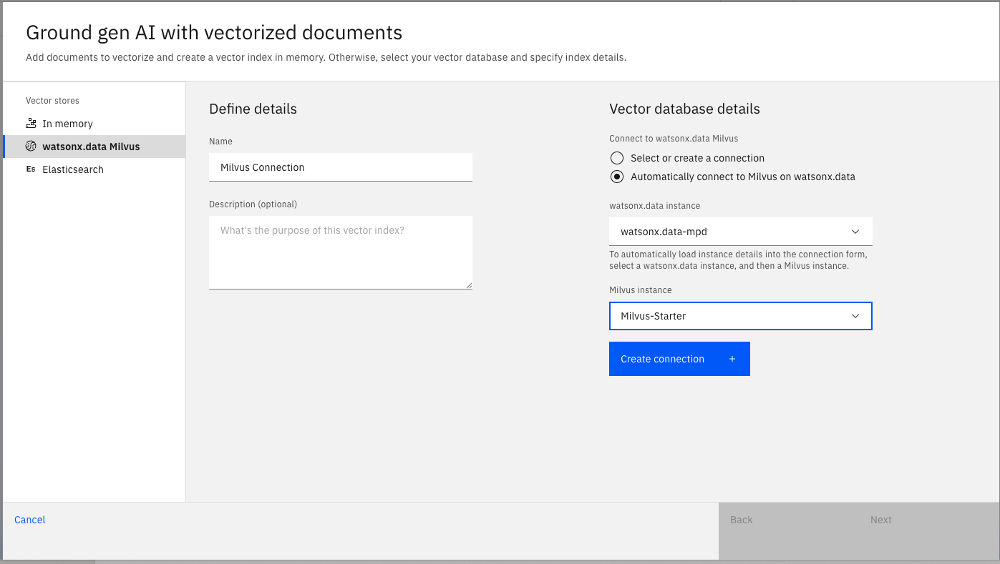
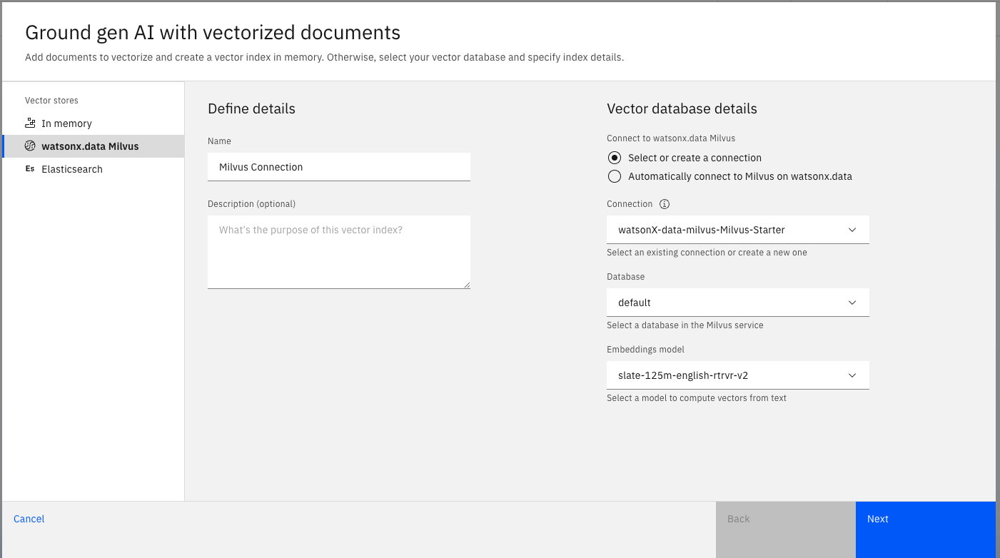
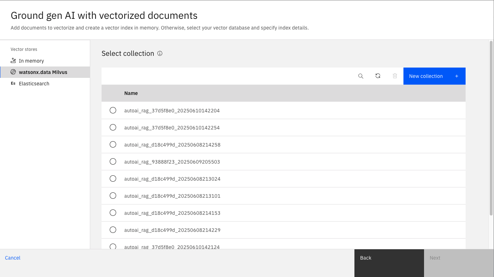
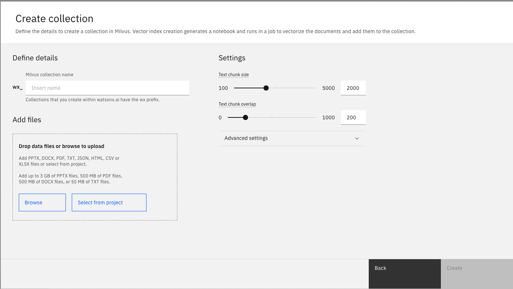

# IBM watsonx.ai - RAG (Retrieval-Augmented Generation) Labs

This repository includes two hands-on labs demonstrating how to build **Retrieval-Augmented Generation (RAG)** applications using IBM watsonx.ai. These labs are designed for technical sellers, AI engineers, and developers who want to combine **large language models** with **enterprise data** securely and effectively.

---

## 🔍 What is RAG?

**Retrieval-Augmented Generation (RAG)** is a powerful pattern that enhances foundation model responses by supplying them with **relevant, external data at runtime**. This is critical in enterprise settings where:

- The model may lack knowledge of recent or proprietary content
- Grounded, source-backed answers are required
- Hallucinations must be reduced or eliminated

RAG works by:
1. **Retrieving** relevant documents or chunks from a database or vector store
2. **Injecting** those into the prompt as context for the foundation model

watsonx.ai supports RAG through:
- Integration with **LangChain** and **ChromaDB**
- Deployment of **custom pipelines**
- Embedding with IBM or open models
- Optional use of **AutoAI** for RAG optimization

---

## 🧪 Included Labs

### 📁 1. Implementing RAG Use Cases

This lab demonstrates the core building blocks of a RAG pipeline:

- Upload and split documents into chunks
- Create embeddings using `sentence-transformers`
- Store vectors in **ChromaDB**
- Use **LangChain** to retrieve and format relevant context
- Ask questions to a foundation model with grounded results

📘 Guide: [IBM watsonx.ai Chat and RAG (PDF)](./IBM%20watsonx.ai_Chat_and_RAG.PDF)
> ⚠️ **Note:** If you already have an existing IBM Cloud account, you can skip the first four steps in the PDF and proceed directly to Chapter 5. 

---

### 📁 2. AutoAI RAG for Technical Sales

This advanced lab builds upon the RAG pipeline and uses **AutoAI** to:

- Automatically explore multiple RAG configurations
- Tune parameters such as:
  - Chunk size
  - Overlap
  - Embedding models
- Evaluate performance across metrics:
  - **Context match**
  - **Faithfulness**
  - **Correctness**

Ideal for **finding optimal setups** in client environments or regulated industries.


📘 Guide:  [AutoAI RAG (PDF)](./IBM%20watsonx.ai_AutoAI_RAG.PDF)
> ⚠️ **Note:** If you already have an existing IBM Cloud account, you can skip the first four steps in the PDF and proceed directly to Chapter 5. 


> ⚠️ **Note:** These labs are optimized for **TechZone-provided environments and accounts**. 
> If you are using a regular IBM Cloud account, you do **not** need to create your own Milvus instance.  
> A shared Milvus database is already available through the **watsonx.data environment**.  


---

## 🔗 Connecting to Milvus on watsonx.data

Once you add the **chat interface block** in your RAG pipeline UI, the following screen will appear:



Follow these steps:

1. On the **left panel**, select `watsonx.data Milvus` as your vector store.
2. Under **Vector database details**, select:
   - `Automatically connect to Milvus on watsonx.data`
   - From the dropdowns, choose your existing instances:
     - `watsonx.data instance`: `watsonx.data-mpd`
     - `Milvus instance`: `Milvus-Starter`
3. Click **Create connection**.

> After clicking **Create connection**, a new screen will appear showing the full **Milvus connection details**, including:
> - Host URL
> - Port
> - Password
> - Username

You will use these credentials in your RAG pipeline configuration if working outside the UI, or integrating with AutoAI

> This will connect your RAG pipeline to a **pre-provisioned Milvus vector database** hosted on watsonx.data, using your current environment’s credentials.


---

## 🔑 Configuring the Milvus Connection

After clicking **Create connection**, you will see the following screen where you can confirm and configure your Milvus connection settings:



Here's what each field means:

- **Connection**:  
  This is the identifier for the Milvus connection. Select the one you just created (e.g., `watsonx-data-milvus-Milvus-Starter`).

- **Database**:  
  Choose the database where vector indexes will be stored. The default name is usually `default`.

- **Embeddings model**:  
  Select a model to generate vector representations from your text.  
  Example: `slate-125m-english-rtrvr-v2` is a lightweight English retriever model suitable for testing.

> These settings define where and how your document chunks will be vectorized and indexed in Milvus.

Click **Next** to proceed and start uploading your documents.

---

## 📁 Selecting or Creating a Milvus Collection

Once you have configured your Milvus connection, you will be prompted to select a **collection** (vector table) where your document vectors will be stored:



At this stage you can:

- Click **New collection** to create a new one

> 🔹 We recommend creating a new collection for each RAG experiment or use case to keep your vector data organized.

After selecting or creating your collection, click **Next** to proceed with document upload and vectorization.


---

## 🆕 Creating a New Collection in Milvus

If you click **New collection**, you will see the screen below where you can define your collection name, upload files, and configure chunking parameters:



### 📝 Steps:

1. **Milvus collection name**:  
   Enter a name for your collection (e.g., `wx_customer_docs`).  
   Note: All collections created within watsonx.ai will be prefixed with `wx_`.

2. **Add files**:  
   Upload documents you want to vectorize by either:
   - Drag-and-dropping files,
   - Clicking **Browse**,
   - Or selecting existing files via **Select from project**

   Supported formats: `PDF`, `DOCX`, `TXT`, `JSON`, `CSV`, `XLSX`, `HTML`  
   File size limits apply (e.g., 500MB for PDF).

3. **Chunking settings**:
   - **Text chunk size**: Defines the size of each text segment (e.g., 2000 tokens).
   - **Text chunk overlap**: Amount of overlap between chunks (e.g., 200 tokens)  
     This helps preserve context across segments.


After configuration, click **Create** to launch the vectorization job.

> ⚙️ A background notebook job will start to generate embeddings and load them into your Milvus collection.

---

---

## 📘 Accessing Milvus Credentials in Notebooks

If you're working in a notebook environment (e.g., `RAG Use Case with Milvus.ipynb`), you can programmatically access the Milvus connection details using the `wslib` library:

```python
# List all available connections
wslib.list_connections()

# Fetch Milvus connection credentials by name
milvus_credentials = wslib.get_connection('watsonX-data-milvus-Milvus-Starter')

# Display credentials
milvus_credentials
```
> 💡 **Note:** The same Milvus connection and credentials accessed above can also be reused in the **AutoAI RAG lab**.  


## 👥 Contacts
- Stefan Vogel – [stefan.vogel@ch.ibm.com](mailto:stefan.vogel@ch.ibm.com)
- Naim Zierau – [Naim.Zierau@ibm.com](mailto:Naim.Zierau@ibm.com)
- Husniye Sekeroglu – [Huesniye.Sekeroglu@ibm.com](mailto:Huesniye.Sekeroglu@ibm.com)  

---

> 💬 Use these labs to explore enterprise-ready GenAI, enable document-grounded assistants, and test RAG in sales demos or PoCs.
